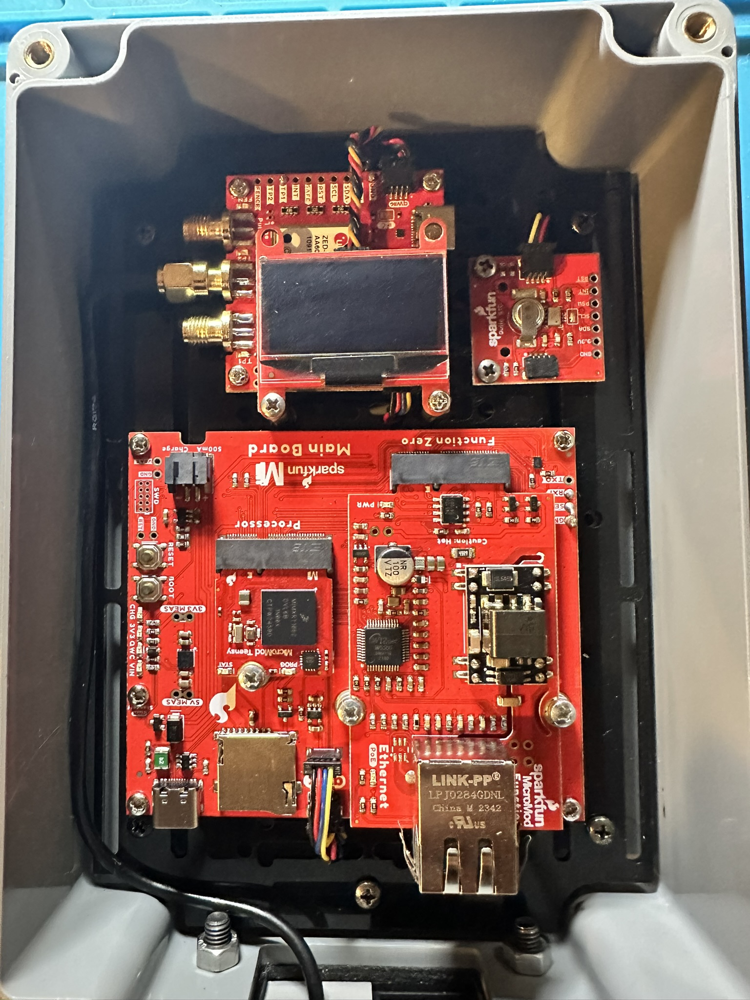
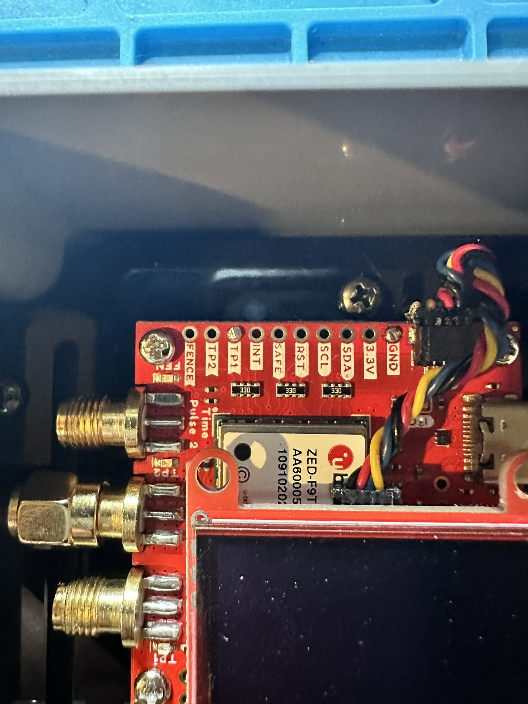
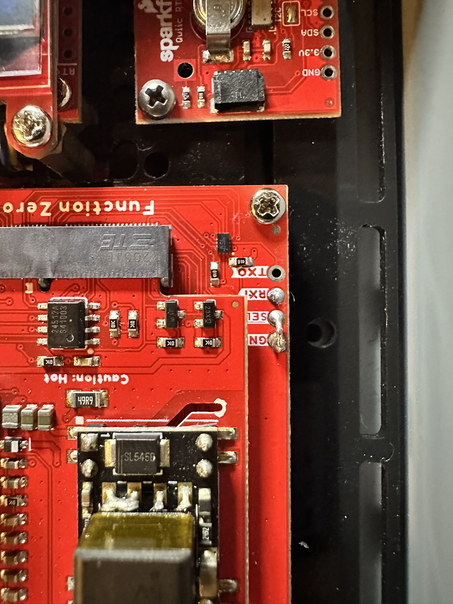
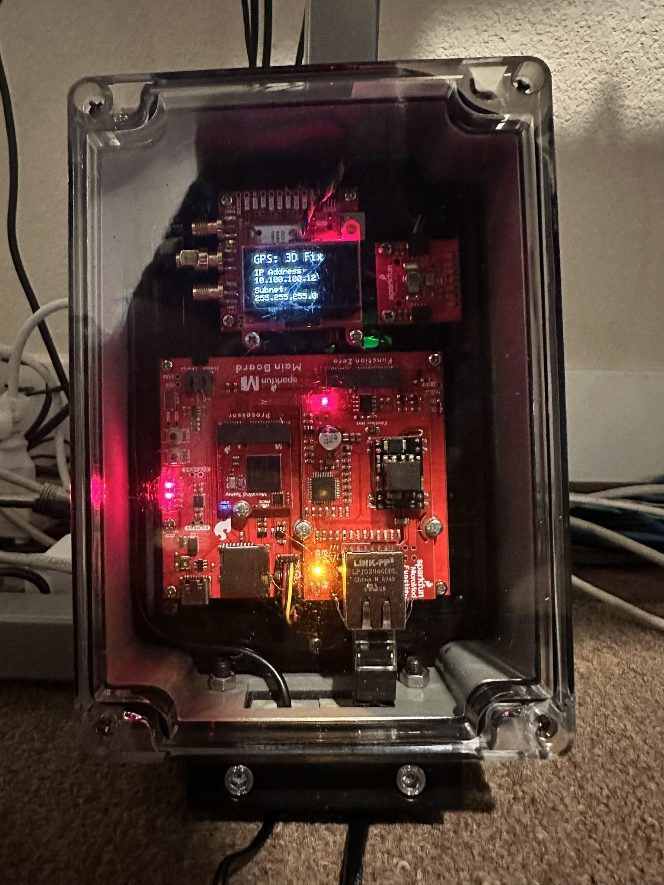

# TeensyTimeServer

<p align="center">
  
</p>

TeensyTimeServer is a self-contained, GNSS-based NTP hardware server for a local Ethernet network. A SparkFun ZED-F9T supplies UTC and a precision 1 Hz time pulse, the Teensy MicroMod maintains a pulse-anchored local clock, and the W5500 serves NTP on UDP port 123 while the web interface provides status, configuration, logs, RTC controls, and firmware updates on TCP port 80 (HTTP).

The design favors timing accuracy and unattended operation. NTP timestamps are derived from the captured TP1 edge and its validated `UBX-TIM-TP` UTC data instead of treating the arrival time of an I2C message as the exact start of a second.

The code was written and built with Visual Studio 2026 with the Visual Micro Ardunio for Visual Studio extension.  However, you can use Arduino IDE 2.3 or greater to build the code.

I started writing TeensyTimeServe in 2023 and slowly added features over the years.  This project was not vibe coded.  I did 99% of it myself.  However, in August 2026 I use ChatGPT 5.6 Sol to create test code to find some intermittent issues that were causing TeensyTimeServer to freeze and then fix them.  Also, I had ChatGPT create more code comments and write some of the text in this readme. 

## Components

1. SparkFun MicroMod Main Board - Single (DEV-20748)
2. SparkFun MicroMod Teensy Processor
3. SparkFun MicroMod Ethernet Function Board - W5500
4. SparkFun Qwiic OLED - 1.3 in., 128x64 (Qwiic)
5. SparkFun Real Time Clock Module - RV-1805 (Qwiic)
6. SparkFun GNSS Timing Breakout - ZED-F9T (Qwiic)
7. Adafruit LTC4311 I2C Extender / Active Terminator (Qwiic), installed between the ZED-F9T and the MicroMod Main Board
8. GNSS All-Band High Precision Antenna - 5 m (SMA)
9. Sixfab Outdoor IP65 Project Enclosure, 4.9 x 8.3 x 2.3 inches
10. Geekworm M2.5 Hex Brass Spacer/Standoffs Screws Nuts 

Qwiic cables, a short insulated wire for TP1, a short ground wire, mounting hardwarel, Ethernet cabling, and a suitable PoE or USB power source are also required.

## Hardware Layout

- Install the Teensy Processor in the MicroMod processor socket and the W5500 in the Function Board socket before applying power.
- Connect the ZED-F9T and OLED through one physical Qwiic path. Place the LTC4311 inline in that path between the DEV-20748 and the ZED-F9T.
- Plug the RV-1805 RTC into the DEV-20748's second Qwiic connector so it uses a separate physical branch instead of being daisy-chained through the GNSS/OLED path.
- Connect the all-band antenna to the ZED-F9T antenna SMA connector and position the antenna where it has a clear view of the sky.  (*The antenna will receive signals through windows and most non-metal roofing materials.*)
- Maintain a common ground among the Main Board, ZED-F9T, RTC, OLED, and any external power hardware.

The two standard Qwiic connectors provide separate cable paths but are electrically connected to the same primary I2C controller and SDA/SCL bus. The RTC therefore avoids the physical GNSS/OLED daisy chain.

## Connecting the GNSS Time Pulse

Power down the complete assembly before soldering or changing these connections.

| From                | To                  | Purpose                                                               |
| ------------------- | ------------------- | --------------------------------------------------------------------- |
| ZED-F9T `TP1` PTH   | DEV-20748 `RXI` PTH | Routes the 1 Hz time pulse to the Teensy input                        |
| DEV-20748 `SEL` PTH | DEV-20748 `GND` PTH | Holds the Main Board UART selector LOW so `RXI` reaches the processor |
| ZED-F9T `GND`       | DEV-20748 `GND`     | Provides a short return path for the TP1 signal                       |

The wires are running on the underside of the boards and are twisted together to minimize interference.  The pictures depict the soldering points with the wires on the backside.

| ZED-F9T TP1 and ground                                                            | DEV-20748 RXI, SEL, and ground                                                              |
| --------------------------------------------------------------------------------- | ------------------------------------------------------------------------------------------- |
|  |  |

The Qwiic cable already provides a common ground, but a short ground conductor routed beside the TP1 wire is recommended for better signal integrity. A short signal-and-ground twisted pair is preferable.

Important details:

- Use the ZED-F9T `TP1` output, not `TP2` and not the ZED-F9T `D_SEL` pin.
- Ground the **DEV-20748 `SEL` PTH** with a solder bridge or a short wire; this is the carrier-board selector referenced by these instructions.
- With `SEL` LOW, the DEV-20748 routes `RXI` to the Teensy MicroMod primary receive signal, which is Arduino digital pin `0` in this firmware.
- TP1 is an actively driven 3.3 V signal. Use a high-impedance `INPUT` without a pull-up, level shifter, or 50-ohm termination.
- Leave the ZED-F9T `TP1` routing jumper in its factory-closed state unless the TP1 SMA path is intentionally being isolated. The separate `TP1_LED` jumper may be opened to remove the time-pulse LED load.
- Keep the TP1-to-RXI connection short and separated from Ethernet magnets, switching power wiring, and other noisy conductors.

The firmware configures TP1 as an enabled, UTC-aligned, GNSS-synchronized, rising-edge 1 Hz pulse. FlexPWM1 submodule 1 captures the rising edge directly on Teensy pin `0`; the wiring is unchanged. `UBX-TIM-TP` supplies the UTC data associated with that boundary; both must be valid before the pulse clock is used for synchronized NTP responses.

See [PPS_Upgrade.md](PPS_Upgrade.md) for additional background and signal-routing notes.

## Features

### GNSS time from the TP1 rising edge

The ZED-F9T TP1 output is routed to RXI, captured on Teensy pin `0`, and associated with a validated `UBX-TIM-TP` UTC data to control the NTP clock. Using the hardware rising edge as the precise second boundary avoids variable I2C polling and message-arrival latency, producing more stable and accurate NTP timestamps.

### NTP clock precision target: 2^-20 seconds

Version 3.2.1 targets an NTP clock precision of `-20`, equivalent to approximately 0.954 microseconds. Precision describes local clock resolution and clock-read cost; it does not specify network latency or client synchronization accuracy.

- PPS edges are latched by the existing pin's FlexPWM capture hardware. At the normal 600 MHz CPU / 150 MHz bus configuration, timer resolution is approximately 6.67 ns. Interrupt-entry latency does not set the captured edge time.
- The clock retains fractional timer ticks while estimating the number of ticks per GPS second. This avoids the former whole-microsecond averaging deadband.
- Timestamp interpolation uses a precomputed fixed-point scale, with multiplication and shifts in the clock-read path.
- After the first confirmed UTC lock, the firmware measures 256 complete clock reads with the CPU cycle counter. It uses the fastest valid read, including capture access and freshness validation, and conservatively includes the timer resolution. It advertises `-20` only if that measurement supports it; otherwise it advertises the measured, coarser exponent and records an error. At 600 MHz, the target permits at most 572 CPU cycles per read.
- The capture driver extends timer rollovers and rejects ambiguous pulse captures. It checks for timer continuity and CPU/bus clock changes. A continuity fault leaves NTP unsynchronized until restart. Changing clocks or using another PWM/capture library on FlexPWM1 submodule 1 is unsupported while this clock is active.

The **GPS-Time Config** page and startup logs report the timer frequency, measured clock-read cycles, precision exponent, and whether the target was met. No synchronized response is sent before the precision measurement completes. The nanosecond timer resolution is not a claim of nanosecond absolute UTC accuracy.

#### Verification

Run the host regression suites with `powershell -File tests\RunTests.ps1`. They cover fractional clock correction, capture and counter rollover, timestamp conversion, NTP precision encoding, and the existing firmware behavior.

After installing the new firmware and allowing GPS synchronization, query the appliance:

```powershell
python -B tests/ProbeNtp.py 10.100.100.12 --samples 5
```

Successful synchronized replies should report `leap: 0`, `stratum: 1`, and `precision_exponent: -20`. Check the device's clock-read measurement as well; a packet's precision byte alone does not prove timing performance. The probe makes ordinary NTP requests and does not change the client clock.

### Ethernet glitch handling

The firmware supervises W5500 responsiveness, physical link state, DHCP maintenance, and the NTP and HTTP sockets, escalating failures through socket repair, service reconfiguration, bounded retries, hardware reset, and a final processor restart. This lets the appliance recover from cable, PHY, controller, DHCP, and socket glitches without routinely requiring a manual power cycle.

### Use of a RTC for logs

The RV-1805 RTC is plugged into the DEV-20748's second Qwiic connector, and is used for log timestamps.  This allows accurate date-time on event and error logs even if the GNSS signal is not available.  If the RTC has an issue, the date-time on event and error logs will use the GNSS if available.

### Savable settings

TeensyTimeServer saves configuration changes from the web setup page to non-volatile EEPROM. The settings persist through restarts and power loss.

### Passcode for setup changes

Configuration changes and firmware uploads are protected form changes by a passcode. Users must enter the correct passcode before the server will accept and save protected changes.  There are two passcode.  One is the passcode setup by the user on the Setup page.  The other is a master override password in the Properties.h file. **Don't forget to change this for your build**.

### Alternating the OLED

When Alternate Display is enabled, the firmware applies the setting immediately and then changes OLED polarity at each configured Status Frequency interval. Alternating which pixels remain illuminated spreads panel wear and helps reduce visible burn-in or uneven aging from a static status screen.

### Turning off the OLED

When Display is Off at startup, the firmware does not probe or initialize the OLED; a live on-to-off change sends one shutdown command and then suppresses all OLED-directed I2C transactions until it is re-enabled. Removing optional display transfers from the primary I2C bus lowers the chance that screen updates delay GNSS timing or status work.

### Web firmware updates

The passcode-protected Setup page accepts a Teensy MicroMod Intel HEX image, pauses NTP during the upload, stages and validates the image, and installs it before rebooting. This permits field maintenance without opening the enclosure or connecting USB, while image validation reduces the chance of installing an incomplete or incorrect firmware build.

## Building the Firmware

In Visual Studio with Visual Micro, use **Extensions > vMicro > Open Arduino Project** and select `TeensyTimeServer.ino`. Select **Arduino 2**, **Teensy MicroMod (`teensyMM`)**, and the correct port, then use Visual Micro **Build** or **Build & Upload** instead of Visual Studio's native **Build Solution** command.

An independent command-line build can be run from the project directory:

```powershell
arduino-cli compile --fqbn teensy:avr:teensyMM --libraries C:\Development\Arduino\libraries .
```

## Updating Firmware from the Web Interface

1. Build a plain Teensy MicroMod `.hex` image.
2. Open the server's `/setup` page in a browser.
3. Select the `.hex` file under **Firmware Update** and choose **Upload Firmware**.
4. Enter the setup passcode and confirm the warning.
5. Keep the device powered while the image is uploaded, validated, installed, and the Teensy reboots.
6. Wait for the server to return, then use **Back to Status** on the reboot-wait page.

The final flash replacement is not power-fail-safe. Removing power during installation can require recovery through USB and the DEV-20748 BOOT button.

## Hardware References

- [SparkFun MicroMod Main Board Hookup Guide V2](https://learn.sparkfun.com/tutorials/micromod-main-board-hookup-guide-v2/hardware-overview)
- [SparkFun MicroMod Teensy Processor Hookup Guide](https://learn.sparkfun.com/tutorials/micromod-teensy-processor-hookup-guide/all?print=1)
- [SparkFun MicroMod Ethernet Function Board - W5500 Hookup Guide](https://learn.sparkfun.com/tutorials/micromod-ethernet-function-board---w5500-hookup-guide/all)
- [SparkFun GNSS Timing Breakout - ZED-F9T Hookup Guide](https://learn.sparkfun.com/tutorials/gnss-timing-breakout---zed-f9t-qwiic-hookup-guide/all)

## Software References

- [Microsoft Visual Studio 2026 Community Edition](https://visualstudio.microsoft.com/vs/community/)
- [Visual Micro Arduino IDE for Visual Studio](https://www.visualmicro.com/)
- [Arduino IDE 2.3.x](https://www.arduino.cc/en/software/)

<p align="center">
  
</p>
